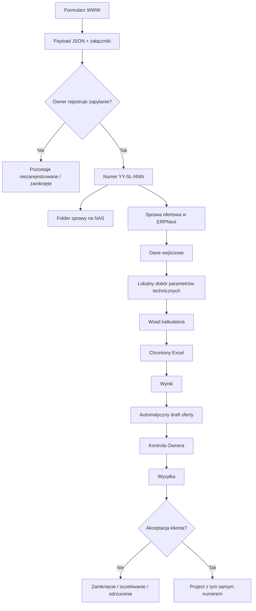

# Architektura i przepływ danych

## 1. Komponenty

### 1.1. Formularz WWW

Odpowiada za:

- zebranie danych inwestycji,
- zebranie parametrów szybu,
- zebranie konfiguracji konstrukcji i zabudowy,
- zebranie wejść i kierunków drzwi,
- zebranie wymagań deklarowanych przez klienta,
- zebranie załączników,
- walidację podstawową po stronie interfejsu,
- przygotowanie uporządkowanego payloadu.

Formularz **nie wykonuje wyceny** i nie zawiera logiki kalkulatora.

### 1.2. Warstwa przyjęcia danych

Po wysłaniu formularza system przyjmuje:

- payload JSON,
- załączniki,
- identyfikator zgłoszenia,
- wersję formularza.

Samo odebranie formularza nie musi automatycznie oznaczać utworzenia pełnej sprawy. Owner decyduje, które zapytania zostają zarejestrowane do dalszej obsługi.

### 1.3. Rejestracja sprawy

Po rejestracji system:

1. nadaje numer `YY-SL-NNN`,
2. tworzy rekord sprawy ofertowej,
3. tworzy pełny folder sprawy według wzorca NAS,
4. zapisuje oryginalne zapytanie i załączniki,
5. tworzy obszar roboczy kalkulacji.

Numer nie jest później używany ponownie, nawet jeśli sprawa zostanie zamknięta bez wysłania oferty lub bez realizacji.

### 1.4. Warstwa danych kalkulacyjnych

Logicznie występują cztery rodzaje artefaktów:

- **dane wejściowe** — fakty z formularza + dane techniczne uzupełnione lokalnie,
- **snapshot cennika** — wersja cen obowiązująca dla konkretnej rewizji,
- **wsad kalkulatora** — uporządkowane wartości przygotowane do użycia przez Excel,
- **wynik kalkulacji** — tylko dane potrzebne do oferty, ERPNext i kontroli.

Nazwy fizycznych plików mogą ewoluować, ale role tych artefaktów pozostają stałe.

### 1.5. Chroniony kalkulator Excel

Kalkulator:

- nie jest przechowywany w publicznym repozytorium,
- zawiera formuły i know-how StalLIFT,
- otrzymuje przygotowany wsad,
- wykonuje obliczenia,
- generuje kontrolowany zestaw wyników.

Backend nie powinien odtwarzać tych obliczeń.

### 1.6. Generator oferty

Po otrzymaniu poprawnego wyniku system generuje draft oferty.

Draft może powstać automatycznie, ale jego wysyłka pozostaje oddzielną czynnością kontrolowaną.

## 2. Przepływ end-to-end



## 3. Zasada rewizji

Dla jednej sprawy:

```text
26-SL-001 / R0
26-SL-001 / R1
26-SL-001 / R2
```

Każda rewizja posiada własny zestaw danych użytych do kalkulacji.

Celem jest możliwość odtworzenia historycznej oferty bez wpływu późniejszych zmian cennika, formularza lub kalkulatora.

## 4. Odpowiedzialność komponentów

| Komponent | Odpowiedzialność |
|---|---|
| Formularz WWW | zebranie danych i ograniczenie błędnych kombinacji |
| Backend / ERPNext | rejestracja, numeracja, walidacja, zapis, orkiestracja |
| NAS | trwałe przechowywanie artefaktów sprawy |
| Warstwa wsadu | przygotowanie wartości dla Excela |
| Excel | obliczenia |
| Warstwa wyniku | bezpieczny eksport wyniku |
| Generator dokumentów | utworzenie draftu oferty |
| Owner | decyzje techniczne, kontrola, zatwierdzenie i wysyłka |

## 5. Zasada fail-closed

Jeżeli brakuje wymaganych danych technicznych albo wynik kalkulacji nie ma jednoznacznego statusu poprawności, system nie powinien generować finalnej oferty do wysyłki.

Może powstać draft roboczy, ale wysyłka pozostaje zablokowana do czasu kontroli.
